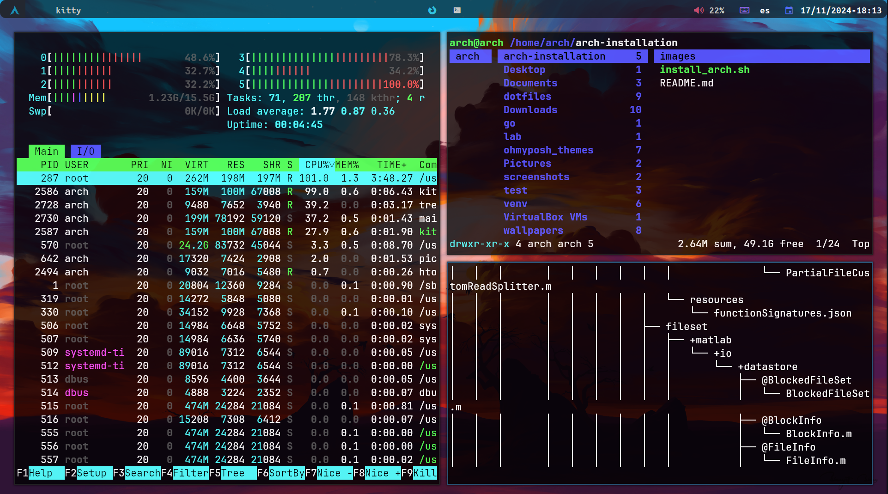
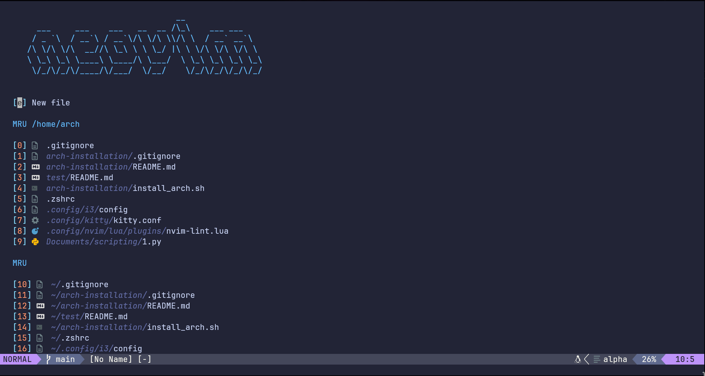

<h1 align="center"> :gear: Wolverinebeast1 i3 build :gear: </h1>

<h1 align="left"> :orange_book: About</h1> 

 

 - OS: [**`Arch Linux`**](https://archlinux.org/)
 - WM: [**`i3`**](https://github.com/i3/i3)
 - Bar: [**`Polybar`**](https://github.com/polybar/polybar)
 - Compositor: [**`Picom`**](https://github.com/yshui/picom)
 - Terminal: [**`kitty`**](https://github.com/kovidgoyal/kitty)
 - App Launcher: [**`Rofi`**](https://github.com/davatorium/rofi)
 - Shell: [**`zsh`**](https://github.com/zsh-users/zsh)
 - Powerline: [**`ohmyposh`** ](https://ohmyposh.dev/)

 
<!-- IMAGES -->

## 🖼️ Gallery

<!-- INSTALLATION -->
## :blue_book: Installation
A guide to installing the system and graphical shell via builder: [EN](docs/arch_installation_EN.md), [ES](docs/arch_insllation_ES.md). 

<!-- HOTKEYS -->
## 💻 HotKeys
* **Open the terminal** - `super + enter`
* **Switch the layout** - `super + 9-0`
* **Open the application menu** - `super + d`
* **Close the window that is in focus** - `super + c`
* **Take a screenshot** - `super + p`
* **Restart i3** - `super + shift + r`
* **Switch to another desktop** - `super + 1-6`
* **Move the window to another desktop** - `super + shift + 1-6`
* **Switch the window to floating mode** - `super + shift + space`

The other hotkeys are in `~/.config/i3/config`.